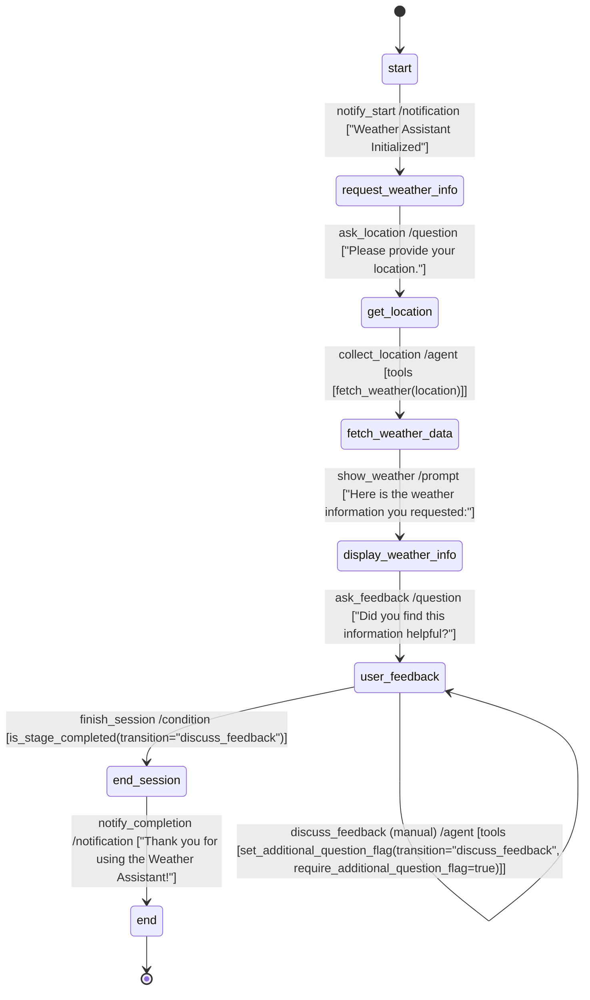

```mermaid
stateDiagram-v2
    [*] --> start
    start --> request_weather_info : notify_start /notification ["Weather Assistant Initialized"]
    request_weather_info --> get_location : ask_location /question ["Please provide your location."]
    get_location --> fetch_weather_data : collect_location /agent [tools [fetch_weather(location)]]
    fetch_weather_data --> display_weather_info : show_weather /prompt ["Here is the weather information you requested:"]
    display_weather_info --> user_feedback : ask_feedback /question ["Did you find this information helpful?"]
    user_feedback --> user_feedback : discuss_feedback (manual) /agent [tools [set_additional_question_flag(transition="discuss_feedback", require_additional_question_flag=true)]]
    user_feedback --> end_session : finish_session /condition [is_stage_completed(transition="discuss_feedback")]
    end_session --> end : notify_completion /notification ["Thank you for using the Weather Assistant!"]
    end --> [*]
```