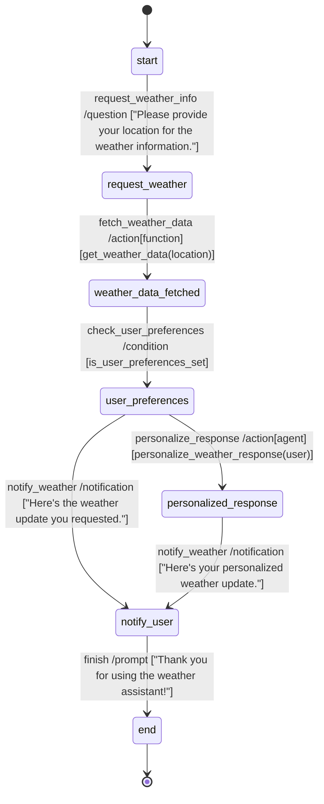

```mermaid
stateDiagram-v2
    [*] --> start
    start --> request_weather : request_weather_info /question ["Please provide your location for the weather information."]
    request_weather --> weather_data_fetched : fetch_weather_data /action[function] [get_weather_data(location)]
    weather_data_fetched --> user_preferences : check_user_preferences /condition [is_user_preferences_set]
    user_preferences --> personalized_response : personalize_response /action[agent] [personalize_weather_response(user)]
    user_preferences --> notify_user : notify_weather /notification ["Here's the weather update you requested."]
    personalized_response --> notify_user : notify_weather /notification ["Here's your personalized weather update."]
    notify_user --> end : finish /prompt ["Thank you for using the weather assistant!"]
    end --> [*]
```