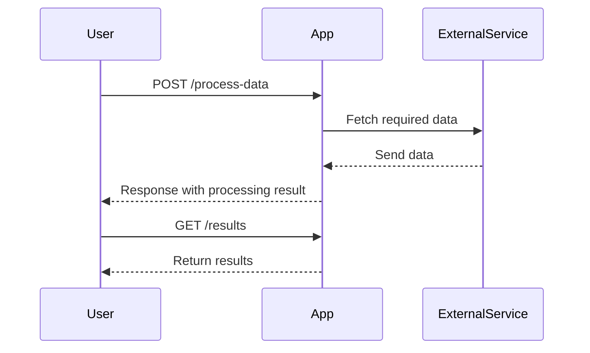

```markdown
# Functional Requirements Document

## API Endpoints

### 1. **POST /process-data**
- **Description**: Accepts input data for processing, invokes external data sources, and performs business logic calculations.
- **Request Format**:
  ```json
  {
    "input": {
      "data_field_1": "value1",
      "data_field_2": "value2"
    }
  }
  ```
- **Response Format**:
  ```json
  {
    "result": "processed_value",
    "status": "success",
    "message": "Data processed successfully."
  }
  ```
  
### 2. **GET /results**
- **Description**: Retrieves results of the previous processing.
- **Request Format**: None (query parameters may be added for filtering if necessary).
- **Response Format**:
  ```json
  {
    "results": [
      {
        "id": "result1",
        "processed_value": "value",
        "timestamp": "2023-01-01T00:00:00Z"
      },
      {
        "id": "result2",
        "processed_value": "value",
        "timestamp": "2023-01-01T00:00:00Z"
      }
    ],
    "status": "success"
  }
  ```

## User-App Interaction


```