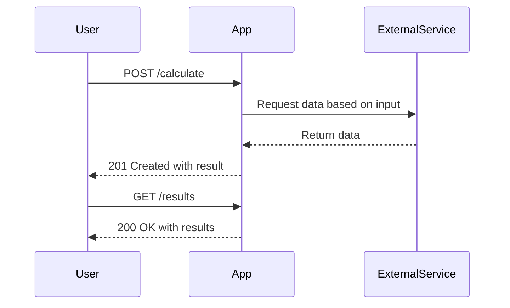
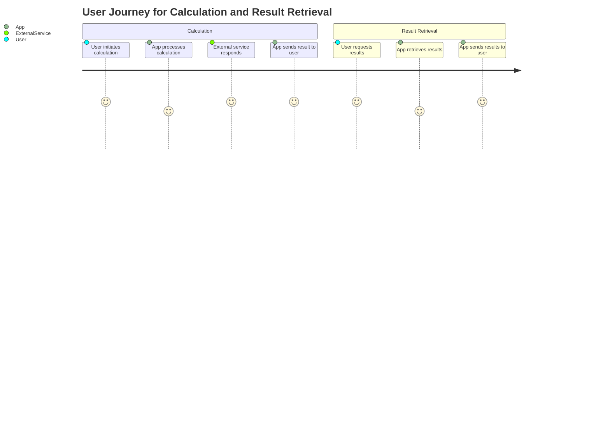

```markdown
# Functional Requirements Document

## API Endpoints

### 1. GET /results
- **Description**: Retrieve the application results.
- **Request Format**: 
  - Query Parameters:
    - `user_id` (optional): The ID of the user whose results are to be retrieved.
- **Response Format**: 
  - 200 OK
    ```json
    {
        "results": [
            {
                "id": 1,
                "data": "Sample result data"
            },
            ...
        ]
    }
    ```
  - 404 Not Found
    ```json
    {
        "error": "Results not found."
    }
    ```

### 2. POST /calculate
- **Description**: Perform calculations or retrieve external data based on the input provided.
- **Request Format**: 
  - Body:
    ```json
    {
        "input_data": "Data for calculation",
        "user_id": "12345"
    }
    ```
- **Response Format**: 
  - 201 Created
    ```json
    {
        "result": "Calculated result",
        "user_id": "12345"
    }
    ```
  - 400 Bad Request
    ```json
    {
        "error": "Invalid input data."
    }
    ```

## User-App Interaction Diagram




```