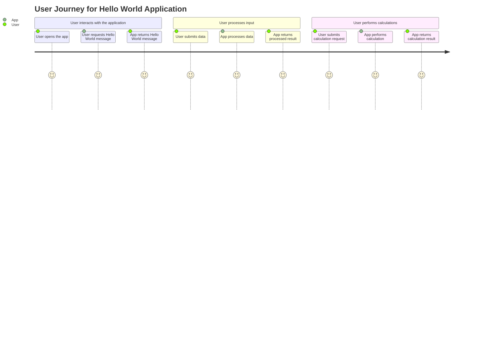
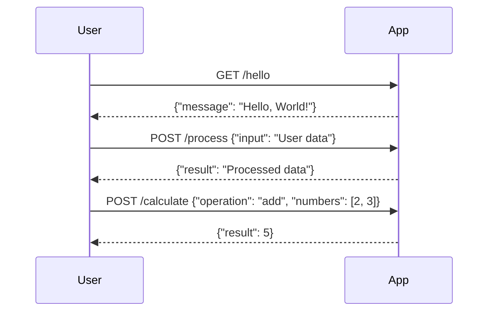

```markdown
# Functional Requirements

## API Endpoints

### 1. Retrieve Hello World Message
- **Method**: GET
- **Endpoint**: `/hello`
- **Description**: Returns a simple "Hello, World!" message.
- **Request Format**: 
  - No request body.
- **Response Format**: 
  ```json
  {
    "message": "Hello, World!"
  }
  ```

### 2. Process User Input
- **Method**: POST
- **Endpoint**: `/process`
- **Description**: Accepts user data, processes it, and returns a response.
- **Request Format**:
  ```json
  {
    "input": "User data to be processed"
  }
  ```
- **Response Format**:
  ```json
  {
    "result": "Processed data or result based on input"
  }
  ```

### 3. Calculation Endpoint
- **Method**: POST
- **Endpoint**: `/calculate`
- **Description**: Performs a calculation based on provided parameters.
- **Request Format**:
  ```json
  {
    "operation": "add|subtract|multiply|divide",
    "numbers": [number1, number2]
  }
  ```
- **Response Format**:
  ```json
  {
    "result": "Calculation result"
  }
  ```

## User-App Interaction Diagram

### User Journey


### Sequence Diagram

```