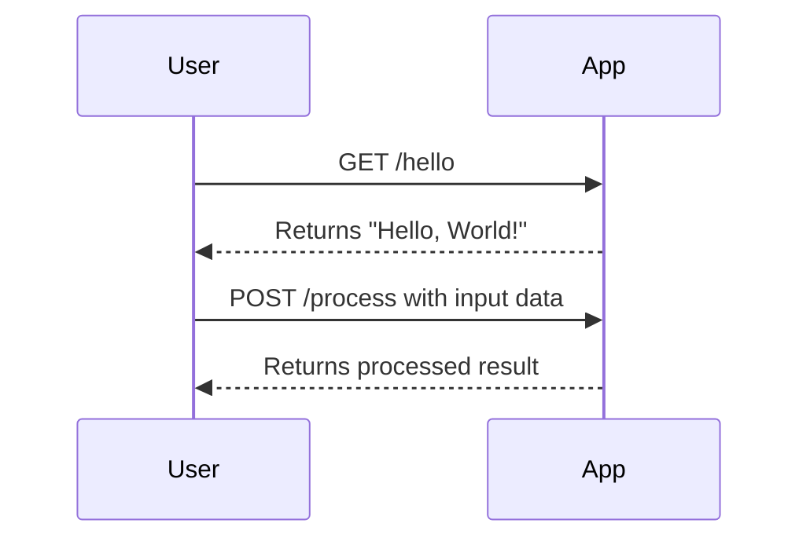

```markdown
# Functional Requirements for the Hello World Application

## API Endpoints

### 1. Hello World API

#### GET /hello
- **Description**: Retrieves a simple "Hello, World!" message.
- **Request Format**: 
  - No request body required.
  - Example Request: 
    ```
    GET /hello HTTP/1.1
    Host: example.com
    ```

- **Response Format**:
  - Content-Type: application/json
  - Example Response:
    ```json
    {
      "message": "Hello, World!"
    }
    ```

### 2. External Data Processing API

#### POST /process
- **Description**: Invokes external data source, performs calculations, and returns results.
- **Request Format**: 
  - Content-Type: application/json
  - Request Body Example:
    ```json
    {
      "inputData": "value"
    }
    ```

- **Response Format**:
  - Content-Type: application/json
  - Example Response:
    ```json
    {
      "result": "Processed value"
    }
    ```

## User-App Interaction Diagram


```mermaid
sequenceDiagram
    participant User
    participant App
    User->>App: GET /hello
    App-->>User: Returns "Hello, World!"
    User->>App: POST /process with input data
    App-->>User: Returns processed result
```
``` 

This markdown document outlines the functional requirements for your Hello World application, including the specified API endpoints and a visual representation of user interaction.